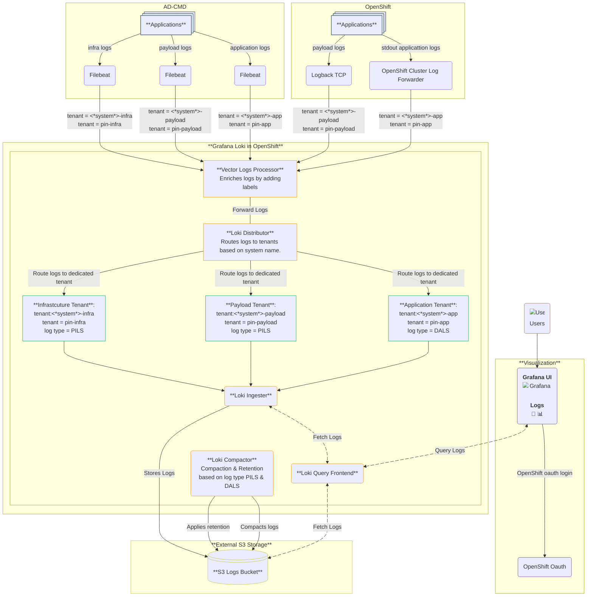

### ArgoCD gitops demo

Originally from Nana Janashia

Original gitlab repo: https://gitlab.com/nanuchi/argocd-app-config.git
YouTube Video: https://www.youtube.com/watch?v=MeU5_k9ssrs


#### Commands

```bash
# install ArgoCD in k8s
kubectl create namespace argocd
kubectl apply -n argocd -f https://raw.githubusercontent.com/argoproj/argo-cd/stable/manifests/install.yaml

# access ArgoCD UI
kubectl get svc -n argocd
kubectl port-forward svc/argocd-server 8080:443 -n argocd

# login with admin user and below token (as in documentation):
kubectl -n argocd get secret argocd-initial-admin-secret -o jsonpath="{.data.password}" | base64 --decode && echo

# you can change and delete init password

```
</br>

#### Links

* Config repo: [https://gitlab.com/nanuchi/argocd-app-config](https://gitlab.com/nanuchi/argocd-app-config)

* Docker repo: [https://hub.docker.com/repository/docker/nanajanashia/argocd-app](https://hub.docker.com/repository/docker/nanajanashia/argocd-app)

* Install ArgoCD: [https://argo-cd.readthedocs.io/en/stable/getting_started/#1-install-argo-cd](https://argo-cd.readthedocs.io/en/stable/getting_started/#1-install-argo-cd)

* Login to ArgoCD: [https://argo-cd.readthedocs.io/en/stable/getting_started/#4-login-using-the-cli](https://argo-cd.readthedocs.io/en/stable/getting_started/#4-login-using-the-cli)

* ArgoCD Configuration: [https://argo-cd.readthedocs.io/en/stable/operator-manual/declarative-setup/](https://argo-cd.readthedocs.io/en/stable/operator-manual/declarative-setup/)


## Architecture Overview





# Loki Monitoring & Performance Dashboard

## Loki Troubleshooting Flowchart

When investigating Loki performance issues, follow this systematic approach:


## Dashboard Links

- **Loki Reads Dashboard**: `/grafana/d/loki-reads`
- **Loki Writers Dashboard**: `/grafana/d/loki-writes`  
- **Loki Reads Resources**: `/grafana/d/loki-reads-resources`
- **Loki Writers Resources**: `/grafana/d/loki-writes-resources`
- **Loki Logs Dashboard**: `/grafana/d/loki-logs`
- **Loki Chunks Dashboard**: `/grafana/d/loki-chunks`
- **Loki Compactor Dashboard**: `/grafana/d/loki-compactor`

## Quick Reference Commands

```bash
# Check current query performance
histogram_quantile(0.95, rate(loki_request_duration_seconds_bucket[5m]))

# Check ingestion rate
sum(rate(loki_distributor_received_bytes_total[5m]))

# Check active streams
loki_ingester_memory_streams

# Check errors
sum(rate(loki_request_failures_total[5m])) by (route, status_code)
```
